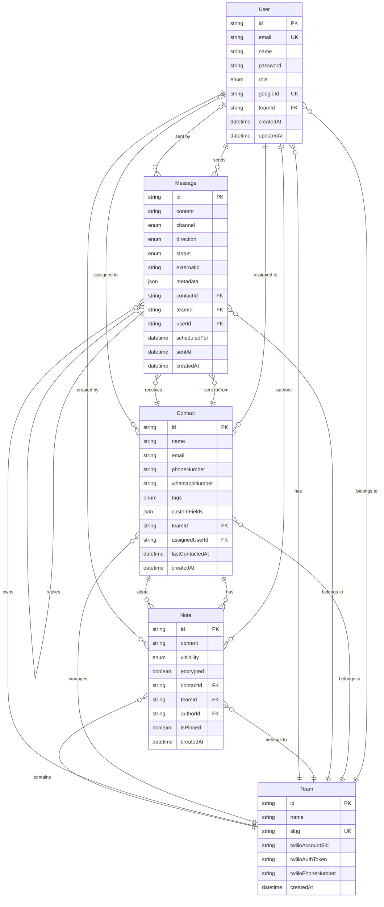

# Unified Multi-Channel Inbox CRM

A modern, full-stack customer relationship management system that unifies communication across multiple channels (SMS, WhatsApp, Email, Social Media) into a single, collaborative inbox.

## 🚀 Tech Stack

- **Framework**: Next.js 14+ (App Router)
- **Database**: PostgreSQL with Prisma ORM
- **Authentication**: Better Auth (Credentials + Google OAuth)
- **Styling**: Tailwind CSS
- **Language**: TypeScript
- **API Integrations**: Twilio (SMS/WhatsApp), Resend, Twitter, Facebook
- **Real-time**: WebSockets / Pusher / Y.js
- **Data Fetching**: React Query
- **Validation**: Zod
- **Code Quality**: ESLint, Prettier, Husky, lint-staged

## 📋 Project Goals

- Unified inbox for all customer communications
- Role-based access control (Admin, Editor, Viewer)
- Real-time collaborative notes with @mentions
- Contact management with auto-merge capabilities
- Message scheduling and automation
- Analytics dashboard for engagement metrics
- Multi-channel support with consistent UX

## 🏗️ Project Structure

```
/
├── app/
│   ├── (auth)/           # Authentication routes
│   ├── (dashboard)/      # Dashboard routes (protected)
│   ├── layout.tsx        # Root layout
│   ├── page.tsx          # Home page
│   └── globals.css       # Global styles
├── components/           # React components
├── lib/
│   ├── prisma.ts         # Prisma client singleton
│   └── utils.ts          # Utility functions
├── prisma/
│   └── schema.prisma     # Database schema
└── ...config files
```

## 🗄️ Database Schema (ERD)

The database schema consists of 5 core models with comprehensive relationships:



### Key Features:

- **Multi-tenancy** via Team model
- **Role-based access** (ADMIN, EDITOR, VIEWER)
- **Unified contacts** across all channels
- **Message threading** and scheduling support
- **Collaborative notes** with visibility controls
- **6 Channel types**: SMS, WhatsApp, Email, Twitter, Facebook, Instagram

## 🔧 Setup Instructions

### Prerequisites

- Node.js 18+ and npm
- PostgreSQL database
- Git

### Installation

1. **Clone the repository**

   ```bash
   git clone <repository-url>
   cd attackCapital
   ```

2. **Install dependencies**

   ```bash
   npm install
   ```

3. **Set up environment variables**

   ```bash
   cp .env.local.example .env.local
   ```

   Edit `.env.local` with your configuration:
   - Database connection string
   - Twilio credentials (for Phase 5+)
   - Better Auth secrets (for Phase 3+)

4. **Initialize the database**

   ```bash
   npx prisma generate
   npx prisma db push
   ```

5. **Run the development server**

   ```bash
   npm run dev
   ```

6. **Open your browser**
   Navigate to [http://localhost:3000](http://localhost:3000)

## 📦 Available Scripts

- `npm run dev` - Start development server
- `npm run build` - Build for production
- `npm start` - Start production server
- `npm run lint` - Run ESLint
- `npm run format` - Format code with Prettier
- `npm run db:generate` - Generate Prisma client
- `npm run db:push` - Push schema changes to database
- `npm run db:seed` - Seed database with demo data
- `npm run db:studio` - Open Prisma Studio

## 🔒 Security Best Practices

- Environment variables for sensitive data
- JWT tokens stored in secure HTTP-only cookies
- Role-based access control
- Input validation with Zod
- Encrypted private notes

## 📄 License

MIT License

## 👥 Contributing

This project follows a structured 10-phase development approach. Each phase is a complete, functional unit with its own commit.
